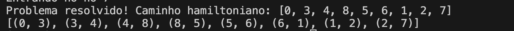
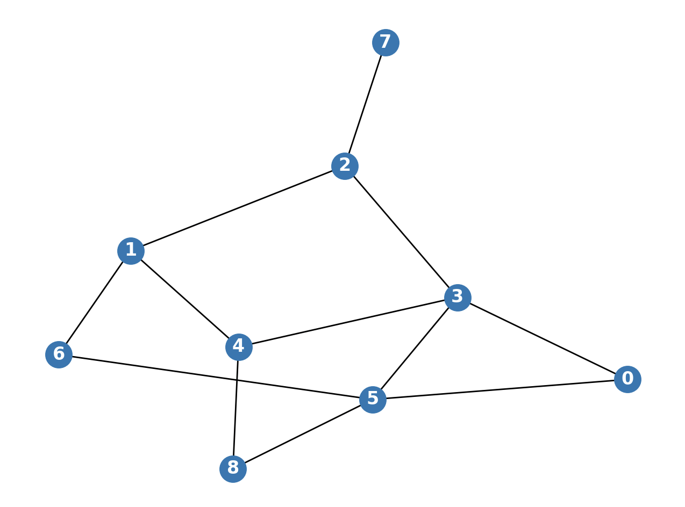
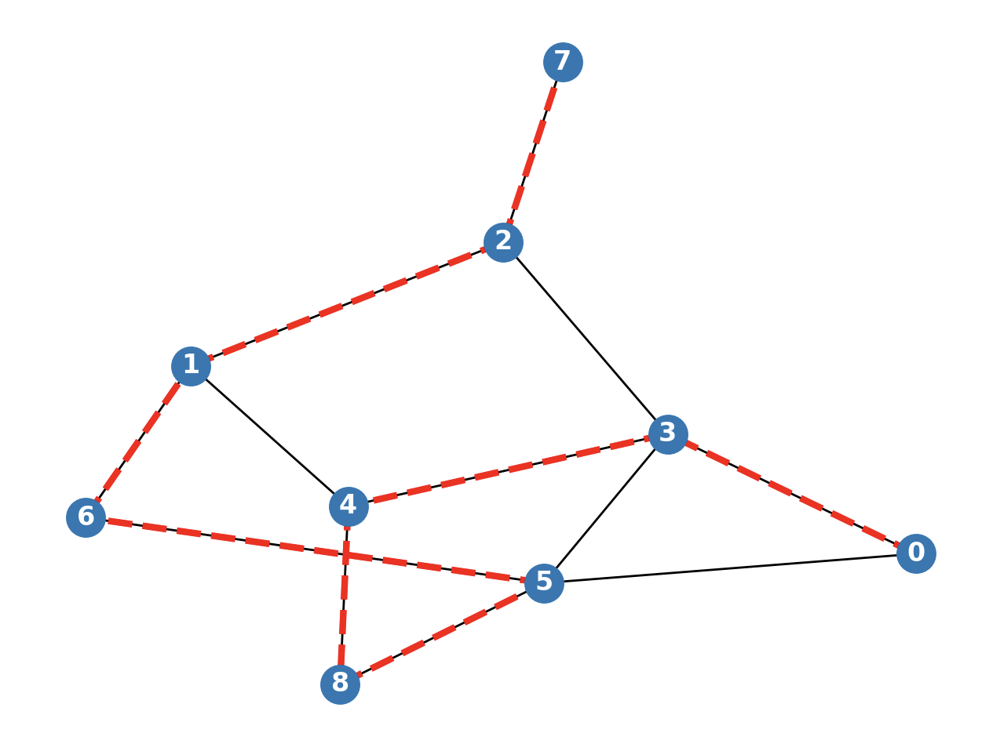
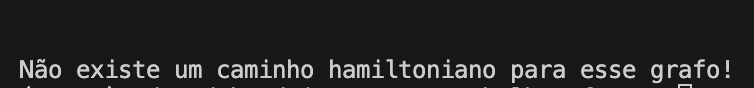

# Caminho Hamiltoniano
O caminho hamiltoniano é um problema clássico e conhecido da computação.
Trata-se da tentativa de se determinar aquele caminho no qual passa-se por todos os nós de um grafo exatamente uma vez.
Existem diveras abordagens possíveis para se resolver esse problema, tais quais: força bruta, algoritmos gulosos, divisão e conquista, backtracking, programação dinâmica, etc.

## O algoritmo implementado
Para entender o algoritmo, a melhor maneira é pensar sobre a ideia central dele.   
O algoritmo basicamente implementa a lógica de um escoteiro perdido na floresta e que precisa chegar à saída. Para isso, ele anda com um caderninho onde anota cada ponto de referência que já passou e sempre toma uma entre 3 opções de decisão quando chega em cada um desses pontos. Essas opções são:
1. Se percorreu todos os pontos de referência, quer dizer que chegou ao fim. Neste caso, o problema foi resolvido e encerrado. Se não chegou ao fim, então:   
    1.1. Se possui opções de trajeto, riscar das opções do local, seguir para o próximo ponto de referência e anotar no trajeto caminhado.
    1.2. Se não possui mais opções no ponto de referência que está, voltar pelo caminho que veio e cortá-lo do mapa da trilha.   
Ao seguir esses passos, o escoteiro eventualmente encontrará a saída desejada.    

Esse algoritmo implementa uma técnica de projeto de algoritmos chamada 'backtracking', que consiste em testar caminhos e voltar caso encontre um "beco sem saída". Caso um caminho seja encontrado, o algoritmo para e devolve a solução encontrada, que não necessariamente é a melhor ou mais eficiente. Neste caso específico, não há impacto negativo uma vez que não existem atributos que definem um caminho como melhor ou pior, como distância entre os pontos.

## O que o código retorna
Caso exista solução, o código exibirá no terminal uma mensagem com o primeiro caminho hamiltoniano encontrado, todos os caminhos percorridos e 2 imagens: uma imagem com o grafo aleatório gerado e outra imagem com o caminho encontrado destacado. Exemplos:    





Por outro lado, caso não exista um caminho hamiltoniano para o grafo gerado, apenas uma imagem com o grafo aleatório gerado será exibida e o que se verá no terminal será tanto o histórico de caminhos percorridos quanto a seguinte mensagem:



## Explicando o código
* Método "andeParaONo()":    
    A cada vez que o método é chamado e executado, o nó atual do caminho percorrido é armazenado (linha 8). Caso todos os nós do grafo já tenham sido percorridos, quer dizer que o caminho hamiltoniano acabou de ser percorrido e esse caminho pode ser retornado e a execução encerrada (linhas 10 e 11). Caso isso não seja realidade (linha 12), o algoritmo analisa suas opções de caminho a partir do nó atual (linha 13), removendo dessas possibilidades os nós já percorridos (linhas 14 a 18). Caso existam caminhos possíveis a se percorrer (linha 19), o algoritmo tentará todas as possibilidades de caminhos (linhas 20 a 27). Caso não existam caminhos possíveis a partir do nó atual, o algoritmo volta para o nó anterior (linhas 28 a 30).
* Método "caminhoHamiltoniano()":    
    Esssa função é responsável, basicamente, por: receber um grafo, isolando os dados de vértices e caminhos (linhas 38 a 38); e chamar o método de caminhada para cada um dos vértices desse grafo (linhas 39 e 40). Caso uma solução seja encontrada pelo método "andeParaONo()", o algoritmo é encerrado e a solução é mostrada no terminal (linhas 41 a 43). Caso nenhum caminho seja encontrado, conclui-se que não existe caminho hamiltoniano para o grafo (linha 44) e esse resultado também é mostrado no terminal. 

## Como executar o código
1. Clone o repositório
2. Abra o projeto na sua IDE de preferência
3. Crie um ambiente virtual python, executando o seguinte comando no terminal:   
```
python3 -m venv .venv
```
4. Ative o ambiente virtual executando o seguinte comando no terminal:    
    
    No Windows:
    ```
    .\.venv\Scripts\Activate.ps1
    ```
    No Mac ou Linux:
    ```
    source .venv/bin/activate
    ```
5. Instale as dependências:   
```
pip install -r requirements.txt
```
6. Navegue até a pasta que contém o código:   
```
cd 03_caminho_hamiltoniano/code
```
7. Abra o arquivo 'main.py'
8. (opcional) Escolha as configurações do grafo a ser gerado aleatoriamente. 
    8.1. Na variável 'nos', escolha a quantidade de nós que o grafo terá (deve ser um número inteiro).   
    8.2. Na variável 'densidade', escolha um número decimal de 0 a 1 para determinar a densidade do grafo a ser gerado aleatoriamente. 1 significa um grafo completo e 0 significa um grafo nulo (sem conexões via arestas). Esse valor indica a probabilidade de um dado par de nós do grafo possuir uma aresta entre eles.

9. Execute o código clicando no botão de executar da IDE ou executando o comando    
```
python main.py
```
10. Para interromper o ambiente virtual, execute o comando:
```
deactivate
```

## Relatório técnico - Análise da complexidade computacional
### Classes P, NP, NP-Completo e NP-Difícil
1. O caminho hamiltoniano se encontra dentro da classe de problemas NP-Completo.
2. Isso ocorre porque o algoritmo está dentro da classe de problemas NP-Difícil e também está dentro de problemas NP. Todo problema NP-difícil que faz parte de NP é chamado justamente de NP-Completo. O algoritmo é NP-Difícil porque é tão difícil quanto qualquer problema NP. Além disso, pode ser **verificado** em tempo polinomial (NP), dada uma certa solução candidata. O algoritmo está na mesma classe de complexidade do caixeiro viajante, com a diferença de que pode ser vericado em tempo polinomial, enquanto que o problema do caixeiro não pode.
### Análise da complexidade assintótica de tempo
1. A complexidade temporal do algoritmo é O(n!).
2. Essa complexidade foi determinada realizando-se contagem de operações. No pior caso, todas as possibilidades de caminhos (até o penúltimo vértice) são analisadas e não existe um caminho hamiltoniano. Como os vértices em um caminho não podem se repetir, chegar até o penúltimo grafo representa a mesma complexidade de se chegar ao último, uma vez que, mesmo que haja uma solução, a partir do penúltimo só se poderia andar para o último grafo restante (uma única opção). Assim, partindo-se de um certo vértice do grafo, tem-se (n-1) opções restantes de caminho (total - vértice atual), depois (n-2) opções (total - vértices visitados), (n-3) (total - vértices visitados) e assim sucessivamente até chegar ao final.
### Aplicação do Teorema Mestre
1. Não é possível aplicar o Teorema Mestre ao algoritmo implementado.
2. O Teorema Mestre exige que o tamanho da entrada reduza proporcionalmente a cada chamada recursiva do algoritmo (n/b). No caso do algoritmo implementado, o tamanho da entrada é reduzido em uma unidade a cada chamada recursiva. Além disso, o valor do parâmentro 'a' demanda que este seja uma constante (sendo tipicamente 2 para algoritos que dividem igualmente a entrada) e o algoritmo implementado faz chamadas recursivas um número n! de vezes. Ou seja, não é um número constante de vezes, mas sim um valor que depende diretamente da entrada, igual ao número de permutações possíveis dessa entrada.
### Análise dos casos de complexidade
1. No pior caso, o grafo não possui um caminho hamiltoniano e existem caminhos possíveis para que o algoritmo percorra, para cada vértice, todas as possibilidades de caminhos até o penúltimo vértice de um possível caminho hamiltoniano, antes de encontrar um 'beco sem saída'. Nesse caso, a complexidade será O(n!). No melhor caso, o primeiro percurso percorrido pelo algoritmo será um caminho hamiltoniano, retornando-o. Nesse caso, a complexidade será O(n). O caso médio é mais difícil de se determinar, pois depende diretamente da densidade do grafo a ser percorrido, sendo mais próximo de O(n) quanto mais denso for e mais próximo de O(n!) quanto menos denso ele for.
2. O desempenho do algoritmo será melhor quanto mais próximo de O(n) ele for, ou seja, grafos com mais arestas (mais possibilidades de caminhos) terão desempenho superior quando comparados com grafos pouco densos (poucas arestas e menos possibilidades de caminhos). Caso a complexidade seja O(n) ou algo próximo disso, o problema será tratável. Porém, para grafos pouco densos e com complexidade próxima ou igual a O(n!), o problema é considerado intratável para entradas grandes (muitos vértices).