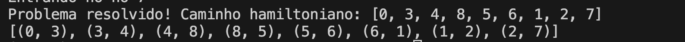
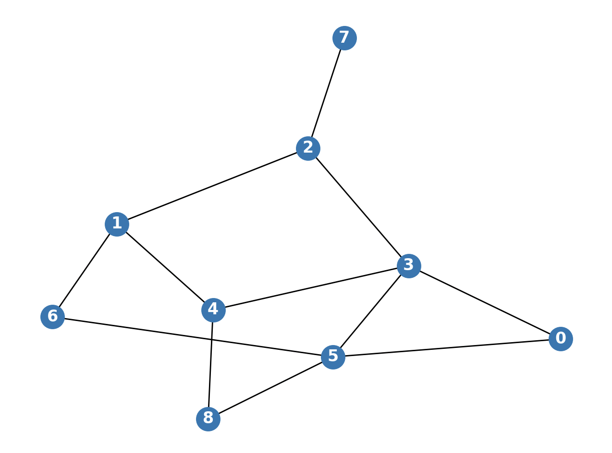
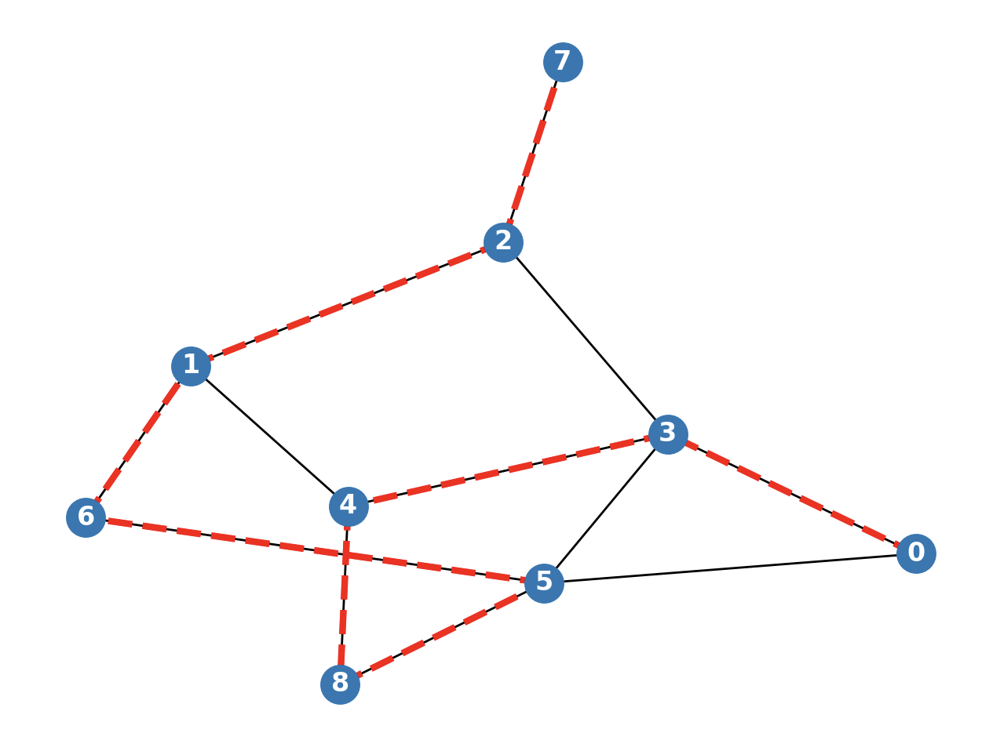
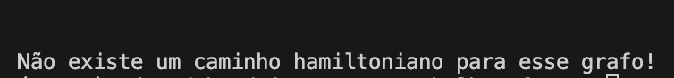

# Caminho Hamiltoniano
O caminho hamiltoniano é um problema conhecido da computação e descrito pelo enunciado clássico do 'caixeiro viajante'.  
Trata-se da tentativa de se determinar aquele caminho no qual passa-se por todos os nós de um grafo exatamente uma vez.
Existem diveras abordagens possíveis para se resolver esse problema, tais quais: força bruta, algoritmos gulosos, divisão e conquista, backtracking, programação dinâmica, etc.

## O algoritmo implementado
Para entender o algoritmo, a melhor maneira é pensar sobre a ideia central dele.   
O algoritmo basicamente implementa a lógica de um escoteiro perdido na floresta e que precisa chegar à saída. Para isso, ele anda com um caderninho onde anota cada ponto de referência que já passou e sempre toma uma entre 3 opções de decisão quando chega em cada um desses pontos. Essas opções são:
1. Se percorreu todos os pontos de referência, quer dizer que chegou ao fim. Neste caso, o problema foi resolvido e encerrado. Se não chegou ao fim, então:   
    1.1. Se possui opções de trajeto, riscar das opções do local, seguir para o próximo ponto de referência e anotar no trajeto caminhado.
    1.2. Se não possui mais opções no ponto de referência que está, voltar pelo caminho que veio e cortá-lo do mapa da trilha.   
Ao seguir esses passos, o escoteiro eventualmente encontrará a saída desejada.    

Esse algoritmo implementa uma técnica de projeto de algoritmos chamada 'backtracking', que consiste em testar caminhos e voltar caso encontre um "beco sem saída". Caso um caminho seja encontrado, o algoritmo para e devolve a solução encontrada, que não necessariamente é a melhor ou mais eficiente. Neste caso específico, não há impacto negativo uma vez que não existem atributos que definem um caminho como melhor ou pior, como distância entre os pontos.

## O que o código retorna
Caso exista solução, o código exibirá no terminal uma mensagem com o primeiro caminho hamiltoniano encontrado e 2 imagens: uma imagem com o grafo aleatório gerado e outra imagem com o caminho encontrado destacado. Exemplos:    





Por outro lado, caso não exista um caminho hamiltoniano para o grafo gerado, o que se verá no terminal será o seguinte:




## Como executar o código
1. Clone o repositório
2. Abra o projeto na sua IDE de preferência
3. Crie um ambiente virtual python, executando o seguinte comando no terminal:   
```
python3 -m venv .venv
```
4. Ative o ambiente virtual executando o seguinte comando no terminal:    
    
    No Windows:
    ```
    .\.venv\Scripts\Activate.ps1
    ```
    No Mac ou Linux:
    ```
    source .venv/bin/activate
    ```
5. Instale as dependências:   
```
pip install -r requirements.txt
```
6. Navegue até a pasta que contém o código:   
```
cd 03_caminho_hamiltoniano/code
```
7. Abra o arquivo 'main.py'
8. (opcional) Escolha as configurações do grafo a ser gerado aleatoriamente. 
    8.1. Na variável 'nos', escolha a quantidade de nós que o grafo terá (deve ser um número inteiro).   
    8.2. Na variável 'densidade', escolha um número decimal de 0 a 1 para determinar a densidade do grafo a ser gerado aleatoriamente. 1 significa um grafo completo e 0 significa um grafo nulo (sem conexões via arestas). Esse valor indica a probabilidade de um dado par de nós do grafo possuir uma aresta entre eles.

9. Execute o código clicando no botão de executar da IDE ou executando o comando    
```
python main.py
```
10. Para interromper o ambiente virtual, execute o comando:
```
deactivate
```