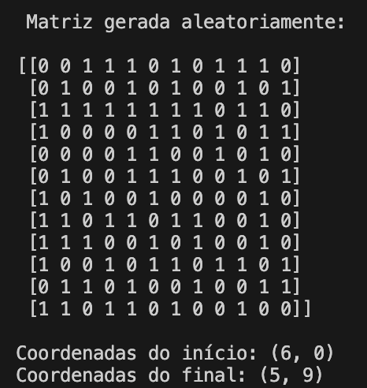
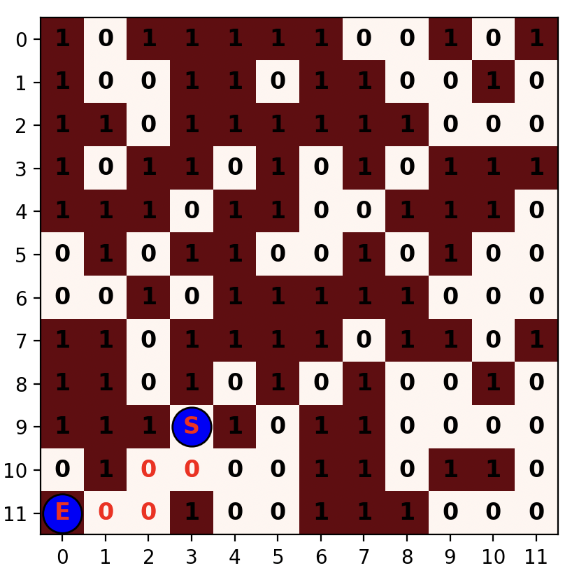
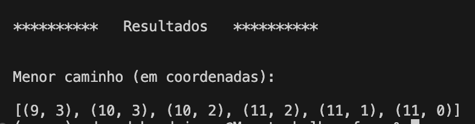
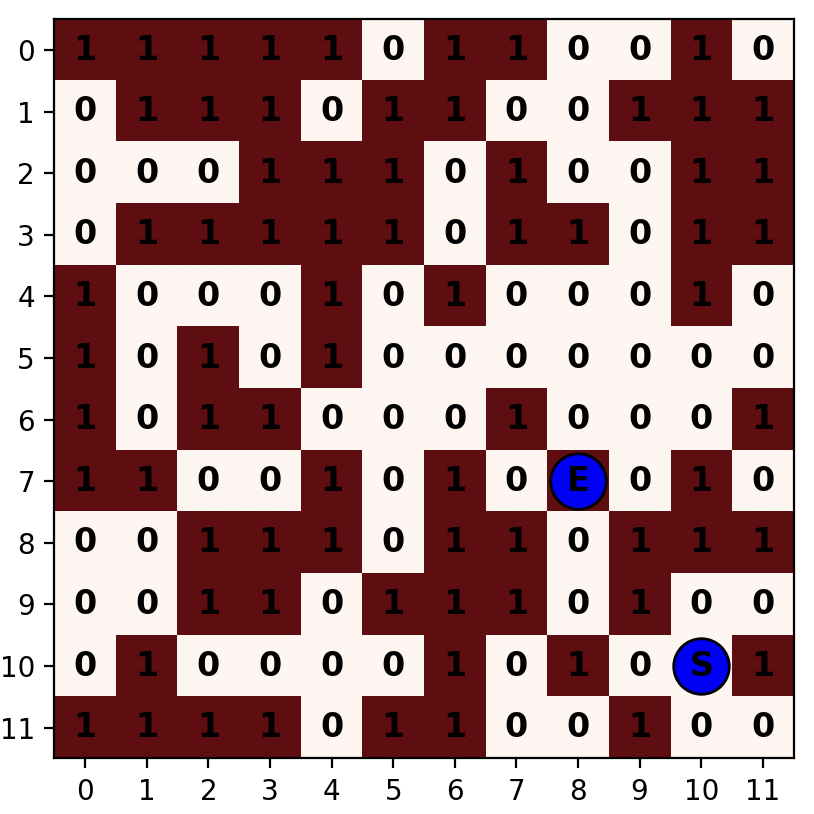
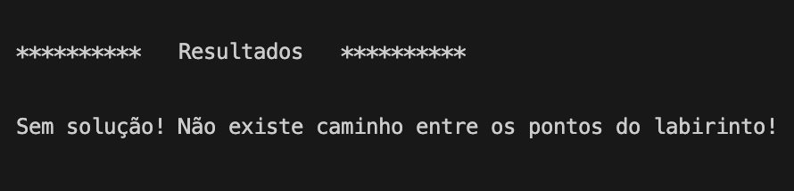

# Algoritmo A*
O algoritmo A* (lê-se "A estrela") é um mecanismo para determinação do menor caminho entre dois pontos de um plano, seja ele um grafo ou uma matriz.

Ele se assemelha muito ao algoritmo de backtracking, com o diferencial de "caminhar" pelo plano priorizando alguma condição/verificação pré-estabelecida, ao invés de fazer isso de forma aleatória. Esse comportamento tenta diminuir o tempo necessário para encontrar o menor caminho, mesmo que essa possibilidade não seja garantida e nem que o caminho encontrado seja, de fato, o menor possível.

## A solução implementada
Neste projeto específico, é gerada uma matriz n X n aleatória utilizando a biblioteca [numpy](https://numpy.org), sendo o n definido pelo usuário no momento da execução do código. Uma vez gerada a matriz, ela é mostrada no console juntamente com os pontos inicial e final, definidos também de forma aleatória através da mesma biblioteca.



A matriz gerada é, então passada para a função 'AEstrela()' juntamente aos pontos inicial e final. Essa função recursiva percorre a matriz, escolhendo o próximo ponto do caminho que respeite às seguintes exigências:
* deve estar dentro dos limites da matriz
* deve ser igual a zero (0)
* deve conter a menor distância para o ponto final, dentre as outras opções possíveis (distância = distância vertical + distância horizontal)

Caso haja uma solução, a função retorna o caminho percorrido (ordem das coordenadas dos pontos percorridos). Caso contrário, retorna nulo ('None').

Resultado caso um caminho seja encontrado:





Resultado caso um caminho não seja encontrado:





O algoritmo (main.py) que chama as duas funções citadas, então, desenha a matriz gerada utilizando a biblioteca [matplotlib](https://matplotlib.org), destacando os pontos inicial e final e o caminho percorrido, se existir.

## Como executar o código
1. Clone o repositório
2. Abra o projeto na sua IDE de preferência
3. Crie um ambiente virtual python, executando o seguinte comando no terminal:   
```
python3 -m venv .venv
```
4. Ative o ambiente virtual executando o seguinte comando no terminal:    
    
    No Windows:
    ```
    .\.venv\Scripts\Activate.ps1
    ```
    No Mac ou Linux:
    ```
    source .venv/bin/activate
    ```
5. Instale as dependências:   
```
pip install -r requirements.txt
```
6. Navegue até a pasta que contém o código:   
```
cd 04_path_finder/code
```
7. Abra o arquivo 'main.py'

8. Execute o código clicando no botão de executar da IDE ou executando o comando    
```
python main.py
```
09. Para interromper o ambiente virtual, execute o comando:
```
deactivate
```
