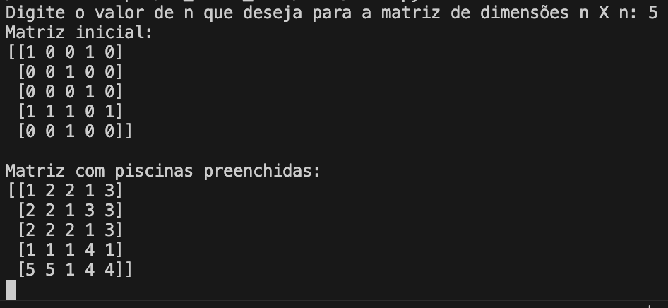

# Flood Fill
Como o próprio nome sugere, o algoritmo Flood Fill busca analisar as áreas distintas que seriam "inundadas" caso se jogasse um líquido dentro das partes "livres" do labirinto, neste caso representadas pelos algarismos "0" da matriz. As barreiras ou muros são representadas pelo algarismo "1".

## O que o código faz:
Ao executar o arquivo 'main.py', o código solicita um valor n ao usuário para gerar uma matriz n X n aleatória. Então, busca por todas as 'piscinas' possíveis dentro da matriz e gera uma nova matriz, substituindo os valores de '0' por valores numéricos de dentro do intervalo [2, n], sendo cada valor para uma 'piscina' diferente. Em seguida, gera uma imagem (heatmap), colorindo de preto os 'muros' (representados pelos algarismos 1) e com cores diferentes cada uma das piscinas encontradas. 

Exemplo do resultado no terminal:

<p align="center">
  
</p>

Exemplo da imagem gerada:

<p align="center">
  
</p>

## Funcionamento do algoritmo
O algoritmo funciona da seguinte forma:
1. A matriz é percorrida, buscando pela primeira área livre, representada pelo algarismo "0".
2. Quando essa área é encontrada, inicia-se, a partir dela, uma busca recursiva por todos os pontos adjacentes dentro da área delimitada pelos limites da matriz e pelos pontos cujos algarismos é igual a "1". Uma vez que todas as opções são exauridas, significa que a "piscina" existente desde o primeiro ponto foi completamente alagada.
3. Então, continua-se percorrendo a matriz, até o final, buscando por pontos dentro de outras "piscinas", que ainda não foram descobertas.
4. Ao final, é retornada uma lista de listas, cada uma representando uma "piscina" diferente.
5. O algoritmo principal recebe a lista de piscinas e, então, substitui os valores dos elementos de cada uma delas
6. Por fim, é gerada uma imagem com colorações diferentes para cada algarismo.

## Como executar o código
1. Clone o repositório
2. Abra o projeto na sua IDE de preferência
3. Crie um ambiente virtual python, executando o seguinte comando no terminal:   
```
python3 -m venv .venv
```
4. Ative o ambiente virtual executando o seguinte comando no terminal:    
    
    No Windows:
    ```
    .\.venv\Scripts\Activate.ps1
    ```
    No Mac ou Linux:
    ```
    source .venv/bin/activate
    ```
5. Instale as dependências:   
```
pip install -r requirements.txt
```
6. Navegue até a pasta que contém o código:   
```
cd 05_flood_fill/code
```
7. Abra o arquivo 'main.py'

8. Execute o código clicando no botão de executar da IDE ou executando o comando    
```
python main.py
```
09. Para interromper o ambiente virtual, execute o comando:
```
deactivate
```