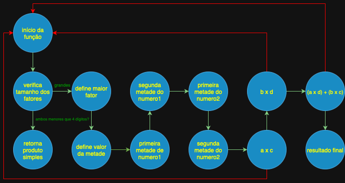

# Algoritmo de Karatsuba
Este algoritmo foi desenvolvido por Anatoli Alexeievitch Karatsuba, em 1960, com o objetivo de simplificar operações de multiplicação de números inteiros grandes.   
Trata-se de um algoritmo de divisão e conquista, que divide cada fator da multiplicação em partes menores e faz-se operações matemáticas sobre essas partes de forma recursiva.   
Diferente da multiplicação padrão (multiplicação por colunas), que possui ordem de complexidade n2, o algoritmo de Karatsuba apresenta ordem de complexidade igual a n5,585          
No processo padrão, os fatores são divididos em várias dezenas e cada uma dessas dezenas são multiplicadas iterativamente entre si e corrigindo o número de zeros à frente de acordo com o cenário, para se ter a dezena correta. Por exemplo, na multiplicação de 32 x 100, o que temos na verdade é a multiplicação de [(10 x 30) + (1 x 2)] x 100. Isso é exatamente igual a [(10 x 30) + (1 x 2)] x [(100 x 1) + (10 x 0) + (1 x 0)]. Então, na prática, faz se exatamente essa multiplicação distributiva porém com um algoritmo em forma de colunas no papel. Como cada algarismo do primeiro fator será multiplicado por cada algarismo do outro fator, entende-se porquê a ordem de complexidade é n2.    
O algoritmo de Karatsuba é um método que deriva da seguinte expressão matemática:    
 
$x = a \times 10^{\frac{n}{2}} + b $   
  
sendo 'x' um dos fatores a ser multiplicado, 'a' a primeira metade do número e 'b' a segunda metade.

De forma análoga, o outro fator pode ser desmembrado como:

$y = c \times 10^{\frac{n}{2}} + d $    
 
Multiplicando x por y tem-se:    

$(a \times 10^{\frac{n}{2}} + b) \times (c \times 10^{\frac{n}{2}} + d) $    
 
$=(a \times 10^{\frac{n}{2}})(c \times 10^{\frac{n}{2}}) + a d \times 10^{\frac{n}{2}} + b c \times 10^{\frac{n}{2}} + b d $
 
 
$= a c \times 10^{2 \times \frac{n}{2}} + (a d + b c) \times 10^{\frac{n}{2}} + b d $
 

Essa é a forma final da expressão. As multiplicações restantes também podem ser resolvidas pelo mesmo algoritmo. Por isso sua natureza recursiva. 

## Complexidade Ciclomática
* Número de nós: 13
* Número de arestas: 13   
M = E - N + 2P    
M = 13 - 13 + 2
M = 2   
De fato, o algoritmo possui dois caminhos possíveis: simplesmente retornar o valor da multiplicação dos fatores pequenos ou seguir o caminho do algoritmo para cálculo recursivo dos seus fatores menores.

### Grafo de fluxo

## Complexidade Assintótica
* Melhor caso: O(1), em tese. Como o computador usa karatsuba: O(nlog23)
* Pior caso: O(nlog23)
* Caso médio: O(nlog23)
* Complexidade espacial: O(n)

## Como executar o código
1. Clone o repositório
2. Abra o projeto na sua IDE de preferência
3. Crie um ambiente virtual python, executando o seguinte comando no terminal:   
`python3 -m venv .venv`
4. Ative o ambiente virtual executando o seguinte comando no terminal:
    No Windows:
    `.\.venv\Scripts\Activate.ps1`
    No Mac:
    `source .venv/bin/activate`
5. Navegue até a pasta que contém o código:   
`cd 1_algoritmo_de_karatsuba/code`
6. Instale as dependências:   
`pip install -r requirements.txt`
7. Abra o arquivo 'main.py' e execute o código clicando no botão de executar da IDE ou executando o comando    
`python main.py`